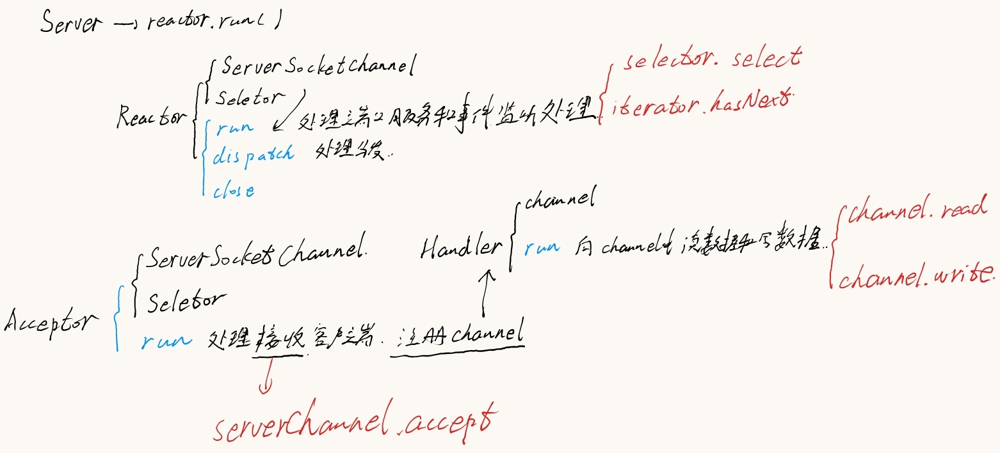
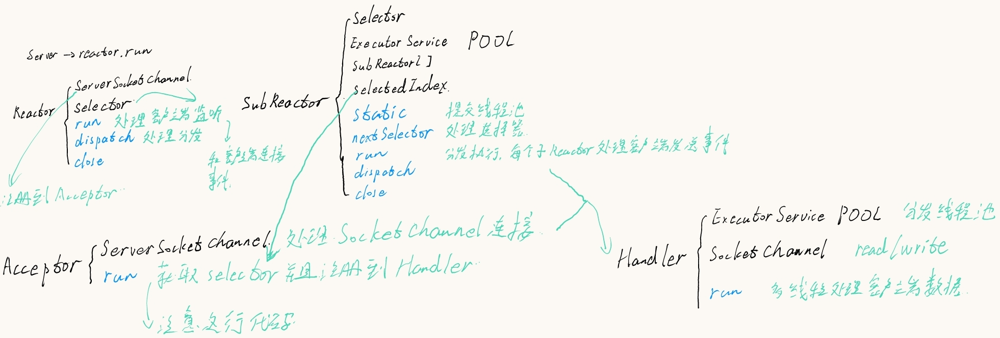
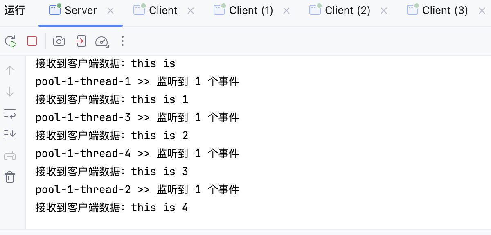

# SubReactor
Reactor -> SubReactor

注意SubReactor是子Reactor，Reactor是反应堆的意思。

关于Reactor的实现见下面仓库，这里不再赘述

>https://github.com/mobaisilent/MultiplexingReactor.git

## 项目体系结构整理

已知Reactor的体系结构如下：



采用SubReactor的模式图如下：

> 可能上半部分存在部分问题，具体参考下半部分。



执行结果如下；



可见用了不同的Reactor来处理每个连接。

但是这里需要注意和区分的是，将每个客户端按照Hash值分发给4个Reactor之后，每个Reactor又将该客户端多线程Handler去处理。

上面第一张图是单线程Handler处理的模式。

> 是啊，蛮抽象的。

## 代码整理

添加了SubReactor和修改了Acceptor两个类。

其他参考Reactor仓库。

SubReactor.java

```java
package com.mobai;

import java.io.Closeable;
import java.io.IOException;
import java.nio.channels.SelectionKey;
import java.nio.channels.Selector;
import java.util.Iterator;
import java.util.Set;
import java.util.concurrent.ExecutorService;
import java.util.concurrent.Executors;

public class SubReactor implements Runnable, Closeable {
  private final Selector selector;

  private static final ExecutorService POOL = Executors.newFixedThreadPool(4);
  private static final SubReactor[] reactors = new SubReactor[4];
  private static int selectedIndex = 0;

  static {
    for (int i = 0; i < 4; i++) {
      try {
        reactors[i] = new SubReactor();
        POOL.submit(reactors[i]);
      } catch (IOException e) {
        e.printStackTrace();
      }
    }
  }

  public static Selector nextSelector() {
    Selector selector = reactors[selectedIndex].selector;
    selectedIndex = (selectedIndex + 1) % 4;
    return selector;
  }

  private SubReactor() throws IOException {
    selector = Selector.open();
  }

  @Override
  public void run() {
    try {
      while (true) {
        int count = selector.select();
        System.out.println(Thread.currentThread().getName() + " >> 监听到 " + count + " 个事件");
        Set<SelectionKey> selectionKeys = selector.selectedKeys();
        Iterator<SelectionKey> iterator = selectionKeys.iterator();
        while (iterator.hasNext()) {
          this.dispatch(iterator.next());
          iterator.remove();
        }
      }
    } catch (IOException e) {
      e.printStackTrace();
    }
  }

  private void dispatch(SelectionKey key) {
    Object att = key.attachment();
    if (att instanceof Runnable) {
      ((Runnable) att).run();
    }
  }

  @Override
  public void close() throws IOException {
    selector.close();
  }
}
```

Acceptor.java

```java
package com.mobai;

import java.io.IOException;
import java.nio.channels.SelectionKey;
import java.nio.channels.Selector;
import java.nio.channels.ServerSocketChannel;
import java.nio.channels.SocketChannel;

public class Acceptor implements Runnable{

  private final ServerSocketChannel serverChannel;

  public Acceptor(ServerSocketChannel serverChannel) {
    this.serverChannel = serverChannel;
  }

  @Override
  public void run() {
    try{
      SocketChannel channel = serverChannel.accept();
      System.out.println(Thread.currentThread().getName()+" >> 客户端已连接，IP地址为："+channel.getRemoteAddress());
      channel.configureBlocking(false);
      Selector selector = SubReactor.nextSelector();
      selector.wakeup();
      channel.register(selector, SelectionKey.OP_READ, new Handler(channel));	
    }catch (IOException e){
      e.printStackTrace();
    }
  }
}
```

